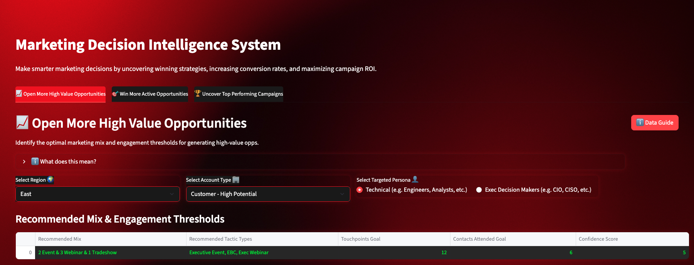

# Joshua Beasley — Data Science Portfolio


Welcome to my portfolio! This repository showcases a curated set of real-world data science and AI projects that I've built from end to end — covering predictive modeling, app development, marketing analytics, fraud detection, and more.


Each project includes:
- Code + Models
- Dashboards or Apps (Streamlit)
- Dataset summaries (synthetic if proprietary)
- Loom walkthroughs (for interactive demos)


---


## Projects Overview


### 1. 💡 Marketing Decision Intelligence System
**An AI-powered Streamlit tool that recommends optimal marketing tactics based on predictive engagement and opportunity modeling.**


- 🔗 [Live Streamlit App](https://marketing-decision-intelligence-system-tpb6grgdoffslvnyzbxh7x.streamlit.app/)
- 📂 [GitHub Repo](https://github.com/JoshBeasley95/marketing-decision-intelligence-system)
- 📽️ [Loom Walkthrough](https://www.loom.com/share/bf65947ee9c14b39a75fe0657adbf441?sid=d08054fb-75c3-4b09-9d47-b3a4c3ce3893)
- 📈 Jupyter Notebook + Visualizations



---

### 2. 🎓 Student Success Prediction
**Capstone project using regression models to predict district-level academic performance from demographic and programmatic features.**

- 📂 [GitHub Repo](https://github.com/JoshBeasley95/Springboard-Data-Science/tree/master/Notebooks/Capstone%202)
- 📈 Jupyter Notebook + Visualizations


---

### 3. 🕵️‍♂️ Metaverse Fraud Detection
**A supervised ML pipeline to detect fraudulent transactions in a simulated metaverse economy.**

- 📂 [GitHub Repo](https://github.com/JoshBeasley95/Springboard-Data-Science/tree/master/Notebooks/Capstone%203)
- 📈 Jupyter Notebook + Visualizations


---


## 🛠️ Installation (Optional)
All apps are available via public Streamlit links. However, if you'd prefer to run them locally:


```bash
# 1. Clone the repo
https://github.com/JoshBeasley95/marketing-decision-intelligence-system.git


# 2. Install dependencies
pip install -r requirements.txt


# 3. Run the app
streamlit run streamlit_app_synthetic_data.py
```


---


## Contact
Have questions or want to connect?
- [Business Email](mailto:texasjmb@gmail.com)
- [LinkedIn](https://www.linkedin.com/in/joshuabeasley/)


---


Thanks for checking out my portfolio!
